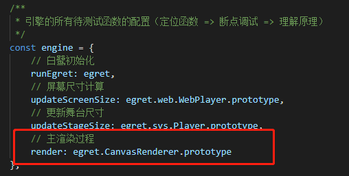
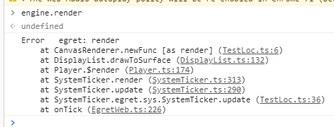
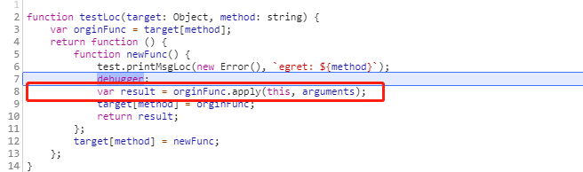
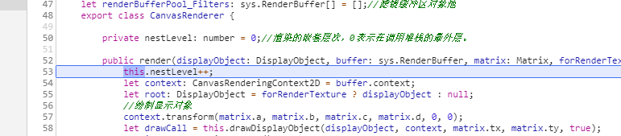

# egret_code
###
将egret源代码放在项目中，利用有效的调用方法，直接调试egret引擎代码，更有利于掌握原理。

# 调试方法的介绍
###
参考代码： [测试方法及配置-文件](game/TestLoc.ts)

## `如何调用引擎的渲染函数`
* [TestLoc.ts文件](game/TestLoc.ts)中配置需要调试的函数： 

    

* 编译, 运行程序后, 在控制台中输入 engine.render (或者直接在代码的某一地方执行engine.render),

     

   上图中展示了render函数执行前的被哪有函数调用，进而可以打出一系列断点跟踪过程。

     
    
    上图中显示了在render函数执行前停下，其实就是orginFunc函数, `单步执行`，就可进入render函数的调用。
    
     

    结论： render方法的被调用前的一系列过程和执行过程都可以直接方便的打断点调试。

* 按照这个调试方法，可以通过配置，添加更多的待测试引擎方法。而且该测试方法，也可以放在其他开发项目中使用。